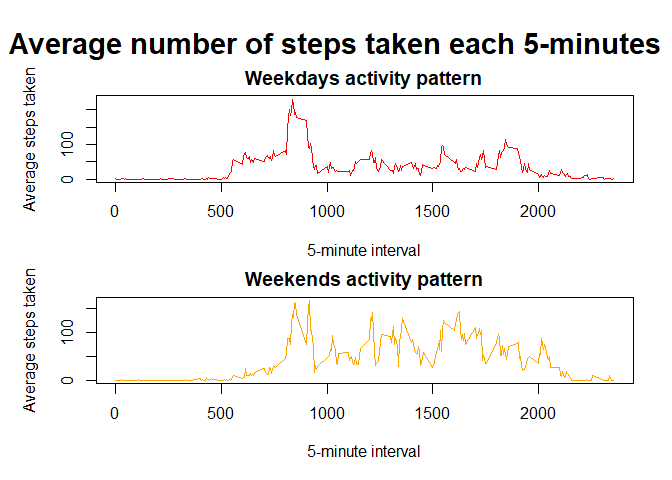

First off, global options are set so that every code chunk is echoed.


```r
library(knitr)
opts_chunk$set(echo = TRUE)
```

## Loading and preprocessing the data

The *activity.zip* file only contains a file: *activity.csv*, so the data are easily read by using the function `read.csv` and unzipping the file from within the function. The activity monitoring data are stored into a data frame called `data`.


```r
data <- read.csv(file = unz("activity.zip", "activity.csv"), header = TRUE)
str(data)
```

```
## 'data.frame':	17568 obs. of  3 variables:
##  $ steps   : int  NA NA NA NA NA NA NA NA NA NA ...
##  $ date    : chr  "2012-10-01" "2012-10-01" "2012-10-01" "2012-10-01" ...
##  $ interval: int  0 5 10 15 20 25 30 35 40 45 ...
```

By calling `str(data)`, it is seen that there are three variables: `steps`, `date` and `interval`; and 17568 observations. However, the `date` variable is of class `character`, so it needs to be set as a date variable by using the `as.Date` function, with argument `format` set equal to `"%Y-%m-%d"`.


```r
data$date <- as.Date(data$date, format = "%Y-%m-%d")
str(data)
```

```
## 'data.frame':	17568 obs. of  3 variables:
##  $ steps   : int  NA NA NA NA NA NA NA NA NA NA ...
##  $ date    : Date, format: "2012-10-01" "2012-10-01" ...
##  $ interval: int  0 5 10 15 20 25 30 35 40 45 ...
```

The data are now tidy and ready to be processed.

## What is mean total number of steps taken per day?

To calculate the total number of steps taken per day, the function `tapply` comes in handy by using the `date` variable as a factor. A list called `totalSteps` is created when calling `tapply` with arguments `X = data$Steps`, `INDEX = data$date`, `FUN = sum` and `na.rm = TRUE`. Since `tapply` coerces the `INDEX` elements into factors, it is not necessary to call `as.factor(data$date)` when setting the `INDEX` argument. Afterwards, this list `totalSteps` is converted into a data frame by using the `as.data.frame` function.


```r
totalSteps <- tapply(data$steps, data$date, sum, na.rm = TRUE)
totalSteps <- as.data.frame(totalSteps)
summary(totalSteps)
```

```
##    totalSteps   
##  Min.   :    0  
##  1st Qu.: 6778  
##  Median :10395  
##  Mean   : 9354  
##  3rd Qu.:12811  
##  Max.   :21194
```

The following code creates a histogram of the total number of steps taken per day, indicating both the mean and the median of these data.


```r
hist(totalSteps[[1]], breaks = 10, main = "Total number of steps taken per day", xlab = "Total steps", col = "whitesmoke")
abline(v = mean(totalSteps[[1]], na.rm = TRUE), lwd = 2, col = "seagreen")
abline(v = median(totalSteps[[1]], na.rm = TRUE), lwd = 3, col = "darkblue")
legend("topright", legend = c("Mean", "Median"), col = c("seagreen", "darkblue"), lty = c(1, 1), lwd = c(2, 3))
```

<!-- -->

From either the summary or the graph, it can be seen that the **mean** number of total steps taken per day is **9354**, whereas the **median** number of total steps taken per day is **10395**.

## What is the average daily activity pattern?

To calculate the average number of steps taken for each 5-minute interval, the function `tapply` proves useful again. This time a list called `averageSteps` is created when calling `tapply` with arguments `X = data$Steps`, `INDEX = data$interval`, `FUN = mean` and `na.rm = TRUE`. Again, it is not necessary to call `as.factor(data$interval)` when setting the `INDEX` argument. This list `averageSteps` is too converted into a data frame by using the `as.data.frame` function.


```r
averageSteps <- tapply(data$steps, data$interval, mean, na.rm = TRUE)
averageSteps <- as.data.frame(averageSteps)
summary(averageSteps)
```

```
##   averageSteps    
##  Min.   :  0.000  
##  1st Qu.:  2.486  
##  Median : 34.113  
##  Mean   : 37.383  
##  3rd Qu.: 52.835  
##  Max.   :206.170
```

The following code creates a time series plot of the 5-minute interval (x-axis) and the average number of steps taken, averaged across all days (y-axis).


```r
plot(unique(data$interval), averageSteps[[1]], type = "l", main = "Average daily activity pattern",
     xlab = "5-minute interval", ylab = "Average number of steps taken", col = "royalblue", lwd = 1.5)
```

<!-- -->

To find which 5-minute interval, on average across all the days in the dataset, contains the maximum number of steps, the function `which.max` is used on the `averageSteps` data frame created previously. This retrieves the index of the data frame containing the maximum of `averageSteps`, which is stored on an integer called `maxsteps`. Now, to find which 5-minute interval this corresponds to, the entry `maxsteps` (**104**) from the vector of interval identifiers is returned by calling `unique(data$interval)[maxsteps]`. The answer is **835**, that is, from **08:35:01** to **08:40:00**. Seems reasonable, since this is a perfect time for going jogging.


```r
maxsteps <- which.max(averageSteps[[1]])
unique(data$interval)[maxsteps]
```

```
## [1] 835
```

## Imputing missing values


```r
summary(data)
```

```
##      steps             date               interval     
##  Min.   :  0.00   Min.   :2012-10-01   Min.   :   0.0  
##  1st Qu.:  0.00   1st Qu.:2012-10-16   1st Qu.: 588.8  
##  Median :  0.00   Median :2012-10-31   Median :1177.5  
##  Mean   : 37.38   Mean   :2012-10-31   Mean   :1177.5  
##  3rd Qu.: 12.00   3rd Qu.:2012-11-15   3rd Qu.:1766.2  
##  Max.   :806.00   Max.   :2012-11-30   Max.   :2355.0  
##  NA's   :2304
```

```r
sum(is.na(data$steps))
```

```
## [1] 2304
```

Only the `steps` variable contains `NA` values, which can be seen by calling `summary(data)`. Another way of calculating the number of `NA` values in `data$steps` is by calling `sum(is.na(data$steps))`. This is done in the previous code, which shows that the total number of `NA` values is **2304**.


```r
data[data$date == "2012-10-01", ]
```

To impute missing values, a reasonable strategy seems like calculating the mean across every 5-minute interval, since a quick examination of the data shows that there are no records for the steps taken on `2012-10-01`, which poses a problem if trying to impute `NA` values by calculating the mean for each day. Another strategy could be calculating the mean by day of the week. Considering that the strategy needs not be sophisticated, and other strategies like **KNN**, **FKM**, **SVD**, **bPCA** or **MICE** are more computationally expensive and this is not an R code to be run multiple times, i.e. a markdown document, the final missing values imputing method will be calculating the mean across each 5-minute interval and assigning it to the corresponding `NAs`.

The following code imputes the `NA` values by using the `data.table` package and, especially, the `nafill` function, which replaces missing values using constant values, in this case the mean calculated across each 5-minute interval. The line `copy(data)` is necessary to avoid rewriting of `data`, which is needed to compare between both data sets, i.e. `NAs` imputed or not.


```r
library(data.table)
dat <- copy(data)
setDT(dat)
cols <- c("steps")
dat[, (cols) := lapply(.SD, function(x) nafill(x, type = "const", fill = mean(x, na.rm = TRUE)))
    , by = interval, .SDcols = cols][]
```

```
##        steps       date interval
##     1:     1 2012-10-01        0
##     2:     0 2012-10-01        5
##     3:     0 2012-10-01       10
##     4:     0 2012-10-01       15
##     5:     0 2012-10-01       20
##    ---                          
## 17564:     4 2012-11-30     2335
## 17565:     3 2012-11-30     2340
## 17566:     0 2012-11-30     2345
## 17567:     0 2012-11-30     2350
## 17568:     1 2012-11-30     2355
```

Similarly, the following code calculates the total number of steps taken per day, now to the data set with `NAs` imputed, i.e. `dat`.


```r
totalStepsImputed <- tapply(dat$steps, dat$date, sum, na.rm = TRUE)
totalStepsImputed <- as.data.frame(totalStepsImputed)
summary(totalStepsImputed)
```

```
##  totalStepsImputed
##  Min.   :   41    
##  1st Qu.: 9819    
##  Median :10641    
##  Mean   :10750    
##  3rd Qu.:12811    
##  Max.   :21194
```

The following code creates a histogram of the total number of steps taken per day, for both data sets: removing `NAs` and imputing `NAs`. 


```r
par(mfrow = c(2, 1), mar = c(4, 4, 2, 1),  oma = c(1, 1, 3, 1))

hist(totalSteps[[1]], breaks = 10, main = "NA values ignored", xlab = "Total steps", col = "whitesmoke")
abline(v = mean(totalSteps[[1]], na.rm = TRUE), lwd = 2, col = "seagreen")
abline(v = median(totalSteps[[1]], na.rm = TRUE), lwd = 3, col = "darkblue")
legend("topright", legend = c("Mean", "Median"), col = c("seagreen", "darkblue"), lty = c(1, 1), lwd = c(2, 3))

hist(totalStepsImputed[[1]], breaks = 10, main = "NA values imputed", xlab = "Total steps", col = "whitesmoke")
abline(v = mean(totalStepsImputed[[1]], na.rm = TRUE), lwd = 2, col = "seagreen")
abline(v = median(totalStepsImputed[[1]], na.rm = TRUE), lwd = 3, col = "darkblue")
legend("topright", legend = c("Mean", "Median"), col = c("seagreen", "darkblue"), lty = c(1, 1), lwd = c(2, 3))

mtext("Total number of steps taken per day", line = 0, font = 2, side = 3, cex = 2, outer = TRUE)
```

<!-- -->

From either the summary or the graph of the data set with `NAs` imputed, it can be seen that the **mean** number of total steps taken per day is **10750**, whereas the **median** number of total steps taken per day is **10641**. A further analysis shows that the minimum, first quantile, median and mean from the total number of steps taken per day with `NAs` imputed are all higher than those from the total number of steps taken per day with `NAs` not imputed. This makes sense since imputation will make all `NA` values to take positive values, and the daily total of steps will go higher because of that.

## Are there differences in activity patterns between weekdays and weekends?

First, a new factor variable must be added to the data set according to whether a date is a weekday or weekend day. To avoid language problems, the function `weekdays` is not used because it returns the name of the day in the current set language. Since I am a Spanish speaker and my R session locale is set at Spanish, `weekdays` will return `"lunes"`, `"martes"`, `"miércoles"`, `"jueves"`, `"viernes"`, `"sábado"`, `"domingo"`, or a third-letter abbreviation. To elude working with this issue, the function `wday` is used on the `date` variable as `POSIXlt`. This will return a number from 0 to 6, which indicates the day of the week, starting on Sunday and ending on Saturday (i.e. Sunday = 0, Monday = 1...).

This variable, called `day`, is then changed into a factor, whose levels are `0`, `1`, `2`, `3`, `4`, `5` and `6`. These levels are reassigned into `"weekday"` or "`weekend`" according to the number: `0`, `5` and `6` are Sunday, Friday and Saturday, respectively. It must be remembered that the data set with these changes is the one with imputed missing data.


```r
dat$day <- as.POSIXlt(dat$date)$wday
dat$day <- as.factor(dat$day)
levels(dat$day) <- c("weekend", "weekday", "weekday", "weekday", "weekday", "weekend", "weekend")
```

The data are split according to the new factor variable.


```r
splitDat <- split(dat, dat$day)
```

The following code chunks will calculate the average number of steps taken for each 5-minute interval, averaged across all weekday days or weekend days.


```r
weekdays <- splitDat$weekday
averageStepsWeekdays <- tapply(weekdays$steps, weekdays$interval, mean, na.rm = TRUE)
averageStepsWeekdays <- as.data.frame(averageStepsWeekdays)
summary(averageStepsWeekdays)
```

```
##  averageStepsWeekdays
##  Min.   :  0.00      
##  1st Qu.:  2.41      
##  Median : 19.96      
##  Mean   : 34.04      
##  3rd Qu.: 53.69      
##  Max.   :222.22
```

```r
weekends <- splitDat$weekend
averageStepsWeekends <- tapply(weekends$steps, weekends$interval, mean, na.rm = TRUE)
averageStepsWeekends <- as.data.frame(averageStepsWeekends)
summary(averageStepsWeekends)
```

```
##  averageStepsWeekends
##  Min.   :  0.00      
##  1st Qu.:  1.76      
##  Median : 33.72      
##  Mean   : 42.05      
##  3rd Qu.: 70.58      
##  Max.   :209.88
```

Finally, the following code will make a panel plot containing a time series plot of the 5-minute interval (x-axis) and the average number of steps taken, averaged across all weekday days or weekend days (y-axis).


```r
par(mfrow = c(2, 1), mar = c(4, 4, 2, 1),  oma = c(1, 1, 3, 1))

plot(unique(data$interval), averageStepsWeekdays[[1]], type = "l", main = "Weekdays activity pattern",
     xlab = "5-minute interval", ylab = "Average steps taken", col = "red", lwd = 1.5)

plot(unique(data$interval), averageStepsWeekends[[1]], type = "l", main = "Weekends activity pattern",
     xlab = "5-minute interval", ylab = "Average steps taken", col = "orange", lwd = 1.5)

mtext("Average number of steps taken each 5-minutes", line = 0, font = 2, side = 3, cex = 1.8, outer = TRUE)
```

<!-- -->

It can be seen that there's not a notorious difference between the activity patterns of weekdays and weekends.
